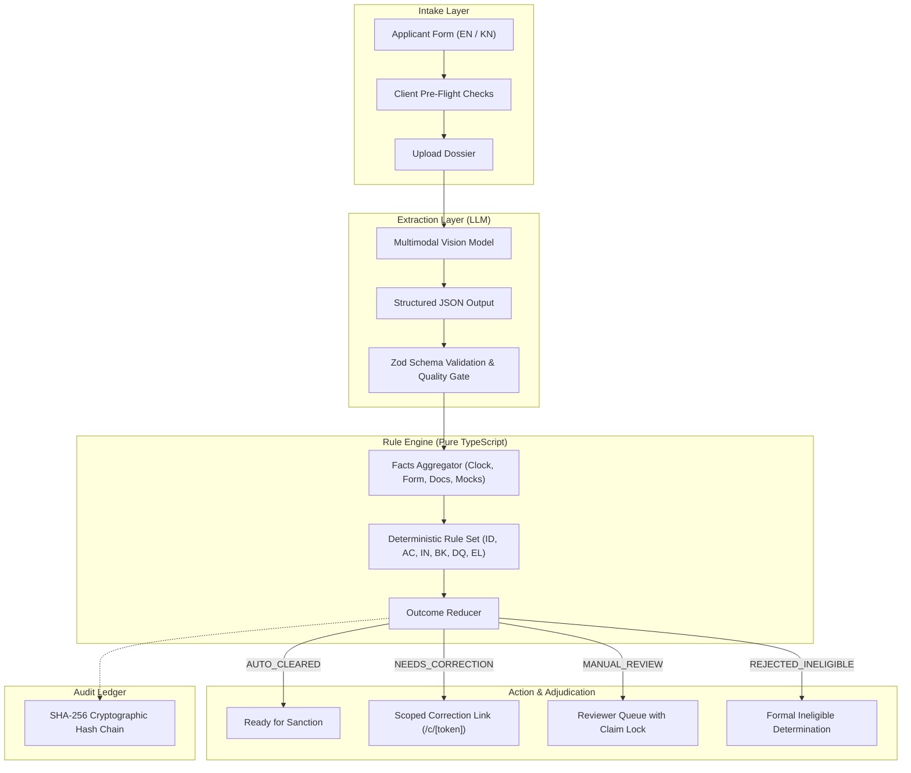

# ScholarFlow

Scholarship application pre-verification that explains problems and routes them for correction.


[](LICENSE)

ScholarFlow is an intake and pre-verification layer designed for public scholarship schemes. Rather than rejecting applications with vague status codes or placing them into unguided "defective" backlogs, ScholarFlow runs deterministic pre-flight checks, explains deficiencies in plain language (Kannada and English), and routes fixable issues into a scoped correction workflow before official departmental adjudication.

---

## Feature Status

| Module / Feature | Status | Description |
| :--- | :--- | :--- |
| **Deterministic Rule Engine** | **Implemented** | Pure, zero-I/O TypeScript engine with injected clock (IST). Evaluates 12 rules across identity, academics, income, banking, quality, and duplicate checks. |
| **Indian Name Matching** | **Implemented** | Unicode NFKC normalization, initial expansion (`K Sumanth` ↔ `Kumar Sumanth`), phonetic transliteration folding (`th/t`, `ee/i`, `v/w`), compound spacing match, and Jaro-Winkler scoring. |
| **Verhoeff Checksum** | **Implemented** | In-memory format validation for 12-digit Indian Aadhaar numbers without storing raw digits. |
| **Audit Hash Chain** | **Implemented** | Synchronous, zero-dependency SHA-256 ledger chaining state transitions and decisions via `sha256(prevHash + canonicalJSON)`. |
| **12 Benchmark Scenarios** | **Implemented** | Automated test suite verifying 12 real-world citizen application outcomes in Vitest. |
| **Interactive Web Suite** | **Implemented** | Next.js 15 application with live scenario benchmark, 7-step intake form, reviewer desk, scoped correction page (`/c/[token]`), and audit chain inspector. |
| **Bilingual Support (EN / KN)** | **Implemented** | Dictionaries and localized explanation messages in English and Kannada. |
| **Document Extraction Schemas** | **Implemented** | Zod schemas and provider interfaces for marksheets, income certificates, caste certificates, passbooks, and masked Aadhaar. |
| **Database Schema & Migrations** | **Implemented** | 15 Prisma models defining users, institutions, applications, documents, evaluations, audit logs, and fraud signals. |
| **Background Job Pipeline (Inngest)** | **In Progress** | Event contracts designed; local dev runner integration in progress. |
| **Multimodal LLM Provider Integration** | **In Progress** | Provider interface defined with `FakeExtractionProvider`; live Gemini/Claude API callers in active staging. |
| **PWA & Offline Drafts** | **Planned** | Service worker and IndexedDB sync for low-connectivity environments. |
| **Government Registry Connectors** | **Planned** | Production adapters for live state portals (e.g., Nadakacheri API, PFMS, DigiLocker). Currently simulated via mock adapters. |

---

## Real vs. Simulated

To ensure transparency for reviewers and judges, the following distinctions define the current build:

* **Real Code:**
  * **Rule Engine:** 100% real, deterministic TypeScript code running in `packages/rules`.
  * **Name Matcher & Validators:** 100% real code handling transliteration, initial expansions, Verhoeff checksums, and date parsing in `packages/matching`.
  * **Audit Hash Chain:** 100% real cryptographic SHA-256 hashing and chain verification running in `packages/db`.
  * **Web Application:** Real Next.js 15 (App Router) interface with interactive states and live client-side rule evaluation.
  * **Data Schemas:** Real Zod schemas and Prisma data definitions.
* **Simulated Components:**
  * **Government Registries:** Real integration with state revenue registries (e.g., Karnataka Nadakacheri) is simulated using `FakeRegistryAdapter` with synthetic records.
  * **Banking / NPCI DBT:** NPCI Aadhaar mapper and bank account seeding checks are simulated via `FakeBankAdapter`.
  * **Document Extraction in Local Demo:** Document OCR uses `FakeExtractionProvider` with canned extraction fixtures to enable reliable, zero-cost, offline testing.
  * **Notifications:** SMS and email delivery are simulated in-memory using `FakeNotificationAdapter`.

---

## Architecture

ScholarFlow separates perceptual document reading from deterministic governance decisions:



---

## Testing Evidence: The 12 Benchmark Scenarios

The complete test suite runs against 12 representative citizen scenarios (`packages/rules/src/scenarios.test.ts`):

| Scenario | Case Description | Primary Rule Trigger | Expected Outcome | Actual Result |
| :--- | :--- | :--- | :--- | :--- |
| **SC-01** | Eligible student with valid marks, income, and bank records | All rules pass | `AUTO_CLEARED` | **PASS** |
| **SC-02** | Academic percentage below scheme minimum cutoff | `AC-001` (HARD_FAIL) | `REJECTED_INELIGIBLE` | **PASS** |
| **SC-03** | Stated percentage conflicts with marksheet marks | `AC-001` (FIXABLE) | `NEEDS_CORRECTION` | **PASS** |
| **SC-04** | Stated family income exceeds scheme ceiling | `IN-001` (HARD_FAIL) | `REJECTED_INELIGIBLE` | **PASS** |
| **SC-05** | Income certificate issued >12 months ago | `IN-002` (FIXABLE) | `NEEDS_CORRECTION` | **PASS** |
| **SC-06** | Legitimate initials expansion (`K Sumanth` vs `Kumar Sumanth`) | `ID-002` (Transliteration Match) | `AUTO_CLEARED` | **PASS** |
| **SC-07** | Substantial name mismatch between form and document | `ID-002` (FIXABLE) | `NEEDS_CORRECTION` | **PASS** |
| **SC-08** | Unrecognized bank IFSC code format or branch | `BK-001` (FIXABLE) | `NEEDS_CORRECTION` | **PASS** |
| **SC-09** | Bank account not seeded with NPCI for Aadhaar DBT | `BK-002` (FIXABLE) | `NEEDS_CORRECTION` | **PASS** |
| **SC-10** | Duplicate Aadhaar hash across existing applications | `EL-002` (HARD_FAIL) | `REJECTED_INELIGIBLE` | **PASS** |
| **SC-11** | Unlisted or inactive educational institution | `AC-002` (HARD_FAIL) | `REJECTED_INELIGIBLE` | **PASS** |
| **SC-12** | Submission timestamp past official scheme deadline (IST) | `EL-001` (HARD_FAIL) | `REJECTED_INELIGIBLE` | **PASS** |

Run tests directly:
```bash
pnpm test
```

---

## Quickstart

### Prerequisites
* Node.js >= 20
* pnpm >= 10 (`npm install -g pnpm`)

### 1. Clone the repository
```bash
git clone https://github.com/Sumanth069/ScholarFlow.git
cd ScholarFlow
```

### 2. Configure environment
```bash
cp .env.example .env.local
```
*(No external secrets or API keys are required to run the local prototype and test suite.)*

### 3. Install dependencies
```bash
pnpm install
```

### 4. Run the automated test suite
```bash
pnpm test
```
*Executes all 32 unit tests across `@scholarflow/matching`, `@scholarflow/rules`, and `@scholarflow/db` in under 3 seconds.*

### 5. Start the local development server
```bash
pnpm dev
```
Open **[http://localhost:3000](http://localhost:3000)** in your browser.

*Note on Database:* The local prototype runs out-of-the-box using pure in-memory rule execution and simulated adapters. A live PostgreSQL instance is only required when persisting full database rows via Prisma (`pnpm db:push`).

---

## Interactive Pages Walkthrough

* **`http://localhost:3000/` (Home / Benchmark):** Interactive simulator allowing you to select different applicant scenarios and watch the rule engine evaluate them in real time.
* **`http://localhost:3000/apply` (Intake Portal):** 7-step guided application flow including data consent, in-memory Verhoeff check, and pre-submission health check.
* **`http://localhost:3000/reviewer` (Reviewer Desk):** Verification queue with concurrency locks, evidence inspection, and correction composer.
* **`http://localhost:3000/audit` (Audit Chain):** Live view of the append-only SHA-256 hash chain with an interactive "Simulate Tamper" button to demonstrate tamper detection.
* **`http://localhost:3000/c/sample-token` (Correction Portal):** Single-use, OTP-gated remedial interface that unlocks only the flagged field while locking non-defective fields.

---

## Known Limitations

1. **Document Noise & Scans:** While synthetic degraders test blur and skew, real-world vernacular certificates from rural revenue offices (e.g., low-resolution photocopies with physical ink stamps) can degrade OCR confidence and necessitate human reviewer routing.
2. **DPDP Implementation Scope:** The system is designed with DPDP Act principles (data minimization, purpose limitation, minor consent, and masked Aadhaar storage). It does not claim formal legal compliance certification, as regulatory enforcement frameworks are evolving.
3. **Registry Silos:** Official government portals (DigiLocker, PFMS, state revenue registries) rarely provide public REST endpoints without formal departmental agreements; mock adapters are used for this demonstration.
4. **Offline Capability:** The current build requires an active local or network server connection. PWA offline caching via IndexedDB is staged for future releases.

---

## External Disclosures & Attributions

* **AI Assistance:** Codebase scaffolding, test fixture generation, and rule definitions developed with the assistance of an AI coding agent. All architecture decisions, algorithms, and tests were reviewed, debugged, and verified by the builder.
* **Data Privacy:** Synthetic data is used across all tests and fixtures. No real citizen personal data (PII) is included in this repository.
* **Reference Data:** IFSC validation patterns and test data derived from public Reserve Bank of India (RBI) directory conventions.

---

## License

This project is licensed under the [MIT License](LICENSE).
